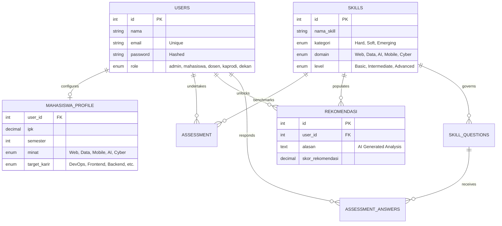

<div align="center">
  <!-- PREMIUM ARCHITECT HEADER -->
  <h1 align="center"></h1>
  <p align="center"><b>Informatics Engineering Student @ Universitas Muhammadiyah Cirebon</b></p>
</div>

<div align="center">
  <!-- PROFESSIONAL DYNAMIC BIO -->
  
</div>

<div align="center">
  <!-- AESTHETIC HIGH-FIDELITY ANIMATION -->
  <br/>
  
</div>

---

### 💻 Professional Summary
Saya mahasiswi **Teknik Informatika Semester 5** di **Universitas Muhammadiyah Cirebon** dengan dedikasi tinggi dalam pengembangan solusi teknologi inovatif. Fokus utama pengembangan saya mencakup arsitektur **Mobile Development** berbasis performa, sistem **Web Development** yang skalabel, serta perancangan antarmuka **UI/UX** yang berorientasi pada pengalaman pengguna. 

Dengan metodologi yang sistematis, saya mengintegrasikan logika pemrograman yang presisi dengan prinsip estetika desain untuk menghasilkan produk digital yang fungsional dan unggul. Saya berkomitmen untuk terus berinovasi dalam infrastruktur TI secara profesional. ✨

---

### 🚀 Technical Ecosystem

<div align="center">

| 📱 Mobile & Core | 🌐 Web Engineering | 🎨 Design & Creative |
| :---: | :---: | :---: |
|  |  |  |

<br/>

| 🛠️ Management & Testing | 📁 Server & DB Tools | 📂 Office Excellence |
| :---: | :---: | :---: |
|  |  |  |

</div>

---

### 📊 Vital Analytics
<div align="center">
  
  
</div>

<p align="center">
  
</p>

---

### ✉️ Let's Connect
<p align="center">
  <a href="mailto:ayuu.riantii25@gmail.com">
    
  </a>
  &nbsp;&nbsp;
  <a href="https://instagram.com/ayuryntii_">
    
  </a>
</p>

<div align="center">
  <br/>
  
  <p><i>"Systematically engineered. Conceptually designed."</i></p>
</div>
T](https://img.shields.io/badge/License-MIT-00c853.svg?style=flat-square)](https://opensource.org/licenses/MIT)
[](https://www.php.net/)
[](#)
[](#)

> **"Elevating technical potential through laboratory-grade AI analysis."**
**ApexSkill AI** is a next-generation career recommendation engine built for IT students. It transforms clinical assessment data into high-fidelity career paths by identifying the natural "technical gravity" of each individual using industry-standard ITEE frameworks.

---

## ✨ Why ApexSkill AI?

Unlike generic assessments, **ApexSkill AI** uses a multi-layered domain analysis to cluster expertise across Frontend, Backend, Data Science, AI, and Cybersecurity. It doesn't just show you what you know; it shows you **who you can become**.

### 🚀 Core Pillars
- **🎯 360° Competency Radar**: A real-time visual audit of Hard Skills, Soft Skills, and Emerging Tech capabilities.
- **🧠 Intelligent Match-Maker**: Predictive algorithms that match your profile against 120+ specialized IT career paths.
- **🏟️ Multi-User Ecosystem**: Integrated dashboards for Students, Lecturers, Department Heads (Kaprodi), and Deans.
- **📉 Skill-Gap Intelligence**: Automated feedback loops that highlight exactly what you need to learn to achieve your target career.

---

## 🛠️ Technical Architecture

| Layer | Technology |
| :--- | :--- |
| **Logic** | PHP 8.2 (Secure Session Handling, PSR-4 Ready) |
| **Persistence** | MariaDB / MySQL (Optimized Indexing & Relational Integrity) |
| **Interface** | HTML5, CSS3, JS, Bootstrap 5.3 (Ultra-Premium Aesthetics) |
| **Experience** | Animate.css, Google Typography (Outfit & Inter), Glassmorphism Utilities |
| **Security** | Bcrypt/Argon2 hashing, CSRF/XSS Protections, SQL Injection Guards |

---

## 🗺️ Information Schema (ERD)



---

## 🔑 Permissions Protocol

| Role | Access Level | Description |
| :--- | :--- | :--- |
| **Administrator** | `SYSTEM_GOD` | Global orchestration, database management, and platform configuration. |
| **Kaprodi** | `DEPT_ANALYTICS` | Department-wide performance metrics and skill distribution reports. |
| **Dosen** | `CLASS_MENTOR` | Focused tracking of student competency growth and assessment status. |
| **Mahasiswa** | `SKILL_OWNER` | Personalized assessments, career roadmap visualization, and profile management. |

---

## 🛠️ Installation & Deployment

### 1. Requirements
- PHP >= 8.2
- MySQL / MariaDB >= 10.4
- Local Server (XAMPP / Laragon / WAMP)

### 2. Manual Setup
1. Clone this repository into your root directory.
   ```bash
   git clone https://github.com/your-username/ApexSkill-AI.git
   ```
2. Create a new SQL database named `db_skill_rekomendasi_ti`.
3. Import the `db_skill_rekomendasi_ti.sql` file.
4. Verify database connectivity in `/config` or via `.env`.

### 3. Finalize
Navigate to `http://localhost/ApexSkill-AI` and start your journey!

---

## 🤝 Contribution and Support
Contributions are what make the open-source community such an amazing place to learn, inspire, and create. Any contributions you make are **greatly appreciated**.

---
*Built with precision for the next generation of IT Talent.*
# SkillPath-AI
